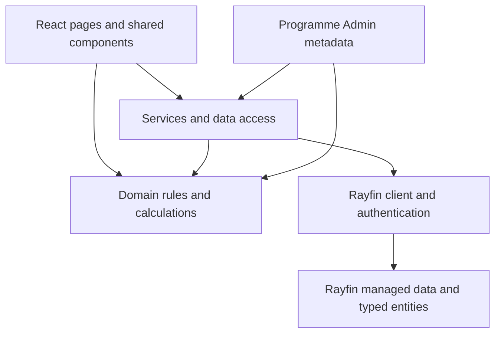
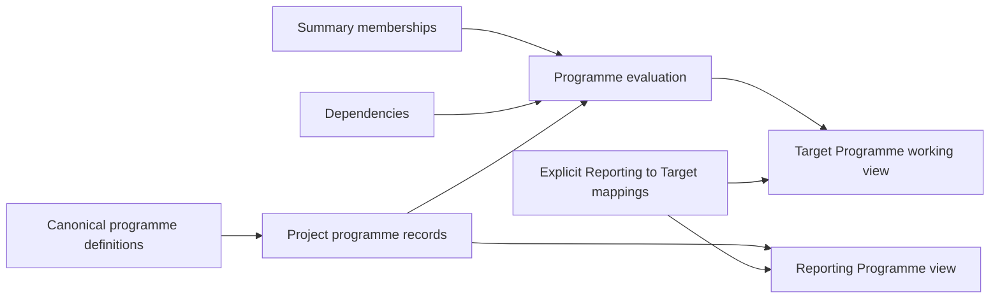

# Architecture overview

## Scope

This document describes the architecture evidenced by the current repository. It is not a complete entity dictionary and does not turn the future parts of `SPEC.md` into current functionality. See [`SPEC.md`](../../SPEC.md), [`IMPLEMENTATION-PLAN.md`](../../IMPLEMENTATION-PLAN.md), and the [security overview](../security/security-overview.md) for related context.

## Application boundary and user areas

There is one Fabric Rayfin application with multiple React routes:

- `/project-index` — authenticated Project Index list/workspace
- `/project-register` — authenticated, role-gated Project Register
- `/admin` — authenticated, Programme Admin role-gated configuration
- `/apps` — authenticated launcher
- `/auth` — authentication page

`/` sends an authenticated user to Project Index. The launcher hides Project Register and Admin cards when the corresponding access check is false.

## Software-layer view

### Frontend layer

`src/pages/` contains route-level workspaces such as `ProjectIndexPage.tsx`, `HomePage.tsx`, `AppLauncherPage.tsx` and `AdminPage.tsx`. `src/components/programme/` contains reusable timeline and Target Programme components. `src/App.tsx` composes routes and access guards.

### Domain/business-rule layer

`src/domain/` holds rules that should not depend on a particular screen: stage mapping/editability (`targetProgrammeStages.ts`), date and reporting mapping behaviour (`reportingProgramme.ts`), summary/dependency evaluation (`programmeRules.ts`), Target row projection (`targetProgramme.ts`), access rules and Programme Admin validation. Tests cover these rules in `src/__tests__/`.

### Service/data-access layer

`src/services/` reads and writes through the Rayfin client, maps entity records into page models, checks authenticated context and coordinates domain evaluation. Examples include `projectIndexService.ts`, `programmeService.ts`, `targetProgrammeService.ts`, `projectService.ts`, `projectHistoryService.ts` and `programmeAdminService.ts`.

### Rayfin/data entity layer

`rayfin/data/` contains typed entity definitions and `schema.ts` exposes the `AppSchema` used by the Rayfin client. Authentication and the data client are initialised in `src/services/bootstrap.ts` and `src/services/rayfinClient.ts`.

## Project identity and source-of-truth ownership

`master_project_register` owns project identity. Related Project Index data uses the active record's `project_guid`/`guid`. The current implementation identifies active projects with `effective_to = 2099-12-31`; lineage uses `parent_guid` and `root_guid`.

| Information | Current owner | Current use |
|---|---|---|
| Site and project identity, lineage and effective dates | `master_site_register`, `master_project_register` | Project list, Register, project selection |
| Project summary and team | `project_index_summary`, `project_team_member` | Project Information workspace |
| Canonical programme row definitions | `programme_item_definition` | Shared row identity, stage, type, order and edit/derived flags |
| Summary relationships | `programme_summary_member` | Derived summary membership |
| Dependency relationships | `programme_dependency_definition` | Target date evaluation |
| Reporting-to-Target mappings | `programme_reporting_mapping` | Explicit comparison/reference links |
| Project-specific date sets | `project_programme` | Baseline, target and reporting dates per project/item |
| Project stage status and DDTC detail | `project_target_stage_status`, `project_target_ddtc_detail` | Current implemented Target slice |
| App roles | `app_user_role` | Project Register and Programme Admin access checks |

## Programme architecture

Canonical definitions and relationships are shared across projects. Project programme records hold the dates for a particular `project_guid`. The current frontend loads a project programme client state, evaluates it, and presents a working view. Target rows may include activities, milestones, summaries and read-only reporting references.

### Date ownership

- Target Programme owns operational **target** dates for normal Target rows.
- Reporting Programme owns **reporting** dates for reporting rows.
- **Baseline** dates exist in `project_programme` but are hidden from the v1 operational UI and retained for downstream comparison/variance analysis.
- Summary dates, dependency-driven dates, month/duration labels and reporting references are derived. They should not become manually maintained competing facts.

The code supports explicit mappings whose labels do not need to match. Dependency validation supports Finish-to-Start (`FS`) relationships, lag days, single controllers and cycle prevention. Summary membership and dependency graphs are checked for cycles before evaluation.

## Project-level working copy and writes

**Current implementation:** `targetProgrammeService.ts` loads a `ProjectProgrammeClientState` containing definitions, records, relationships, stage status and DDTC detail. The Project Index page maintains local React state and updates the working view before or alongside persistence. Programme writes are serialised per key by `src/domain/keyedWriteQueue.ts`; failures are surfaced in save status. This is an optimistic update pattern, not a database transaction guarantee.

**Current implementation:** Target writes require a signed-in user and an active project. `targetProgrammeStages.ts` maps Reporting Stage to Target stages: previous stages are read-only, the current stage is editable, and future stages are editable when mapped. Historical projects cannot be written by the Target Programme service.

**Planned direction:** The canonical documents describe a fuller lifecycle across Land Activation, Site Pipeline, Planning, Detailed Design/Tender/Contract, Construction, Tenure and later Board Report. The current UI and data slice do not prove the full end state. Construction, Tenure and Board Report boundaries therefore remain future/partial areas rather than claims of completed coverage.

## Administration and configuration

Programme Admin is a global configuration area. It edits definitions, summary memberships, dependencies and mappings through `programmeAdminService.ts`; it is not a project-level tab. Stable programme item identity and relationship validation are intentionally centralised so normal project users do not create arbitrary programme rows. Changing metadata such as a row label or mapping should use Admin rather than a TypeScript edit.

The implementation plan’s longer-term direction is stronger group-based access and broader configuration. Current access is role-table based, with a development-only bootstrap path for a configured signed-in email. See the [security overview](../security/security-overview.md) for the evidence and limitations.

## External and client-side dependencies

The browser application depends materially on React, React Router, Rayfin packages, Vite, Leaflet/react-leaflet and Tailwind. The Project Index map uses Leaflet tile imagery through the map component; the exact production tile service, terms and network controls are **To verify**. The browser also stores Rayfin authentication state through the configured client storage option.

## Current boundaries versus future scope

The current architecture supports one app and the implemented Project Register, Project Index information/reporting flows, Target programme rules and Programme Admin. It should not be read as a complete implementation of every area in the specification. Tenure, full Construction delivery tracking and Board Report are current/future boundaries to confirm during later delivery. The specification also describes future Entra group authorisation, richer dependency engines, templates, custom rows and reporting outputs; those are planned direction unless current code proves otherwise.
