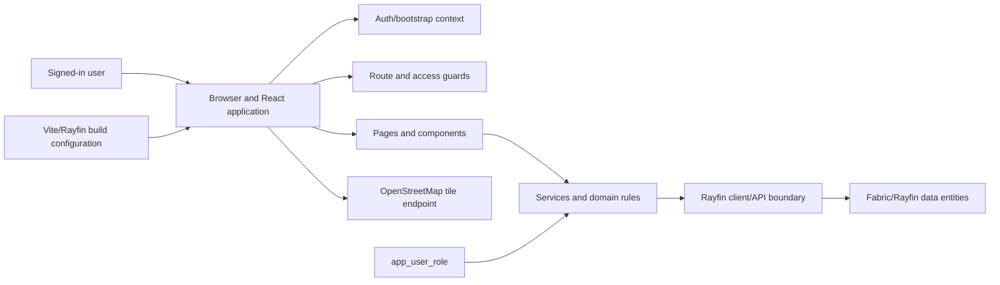
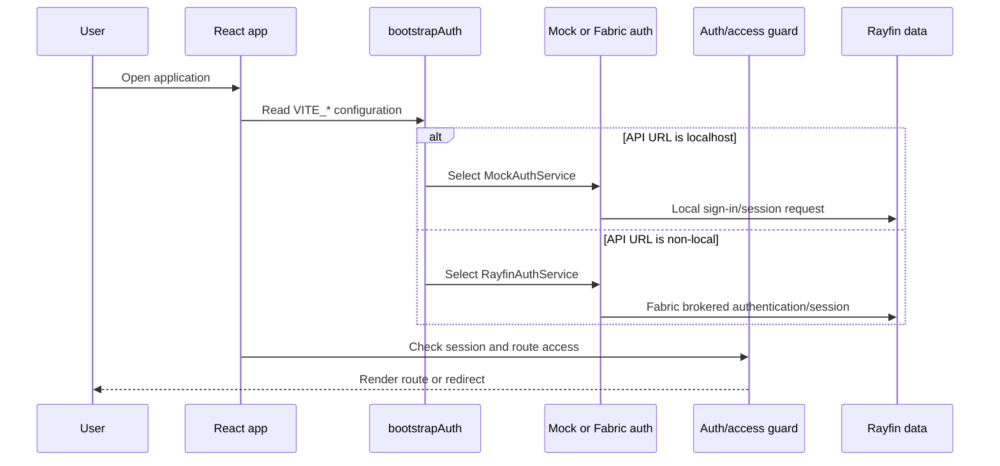
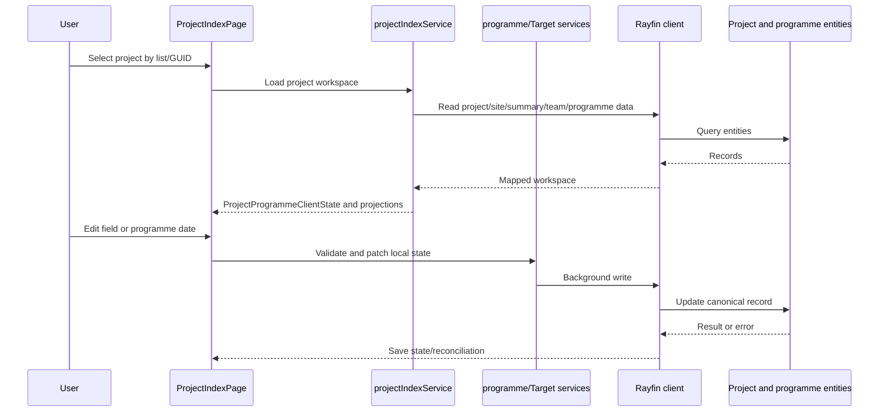
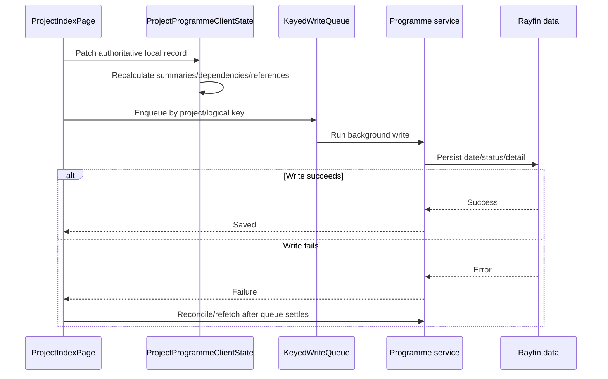
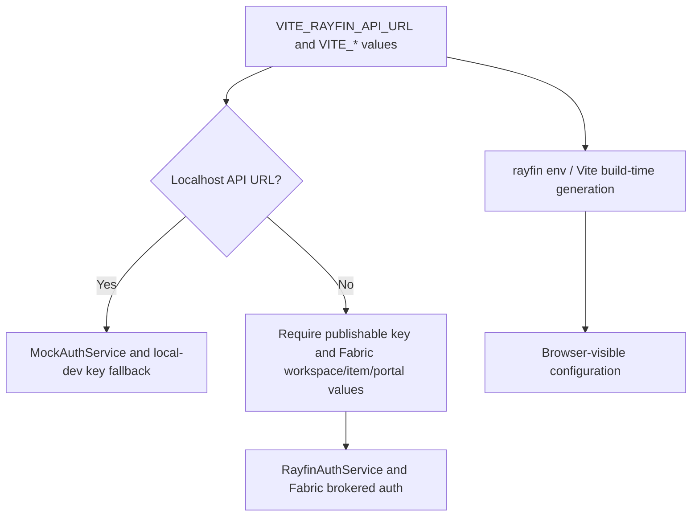

# Data flows and trust boundaries

## Purpose and scope

This document expands the [Architecture Overview](architecture-overview.md) with security-relevant flows and boundaries. It describes the current repository, not a complete platform threat assessment. A **trust boundary** is a point where data, identity or authority moves between components that do not share the same assumptions.

The browser is treated as an untrusted client. A route guard or disabled input can improve the normal user experience, but it is not proof of backend or Rayfin data authorisation.

## Main actors and components



### What the repository proves

- `src/main.tsx` creates the React root, bootstraps authentication and provides `AuthProvider`.
- `src/App.tsx` defines authenticated routes and the Project Register/Programme Admin guards.
- Pages call services; services call the typed Rayfin client and domain rules.
- `rayfin/data/schema.ts` and the entity files define the data resources used by the client.
- `app_user_role` is queried for the Project Register and Programme Admin application access decisions.
- Project Index uses a project-level programme state bundle and the hardcoded OpenStreetMap tile endpoint.

### What remains platform or organisational **To verify**

The repository does not prove Fabric/Rayfin tenant isolation, backend row/entity policy behaviour, production identity configuration, network controls, browser security headers, central logging, or operational ownership. Those boundaries require platform evidence or organisational decisions.

## Trust boundaries

| Boundary | Data/authority crossing it | What this repository proves | To verify outside the repository |
|---|---|---|---|
| User to browser | Credentials, session interaction, project data and user-entered values | The browser renders the React app and can inspect/replay client requests | Session protection, browser hardening, user device controls and token/session policy |
| Browser to route/access guard | Authentication state and role lookup result | Guards redirect unauthenticated or application-unauthorised users in normal flow | Whether direct API/entity calls are independently denied |
| Browser to service/domain layer | Project GUIDs, edits, configuration selections and client requests | Services authenticate some operations, validate domain rules and map records | Complete service coverage and whether callers can bypass checks |
| Rayfin client/API boundary | Authenticated requests, publishable key, reads and writes | `rayfinClient.ts` initialises a typed client with auth storage | TLS, API policy, direct-request enforcement, tenant boundary and platform guarantees |
| API to Fabric/Rayfin data | Entity reads/writes and role/data policy | Entity decorators and schema are committed; some entities use broad authenticated access | Production entity/row policies, privileged access and auditability |
| Browser to OpenStreetMap | Tile requests and network metadata | Leaflet requests the hardcoded standard tile endpoint | Approval, terms/privacy, CSP, outbound restrictions, rate limits and continued use |
| Build configuration to browser | `VITE_*` values and generated Rayfin environment | `bootstrap.ts`, `manifest.json` and Rayfin scripts define current inputs | Production config store, scope, rotation and accidental-disclosure controls |

## Flow 1: authentication/bootstrap and route access



**Current implementation:** `bootstrap.ts` defaults the API URL to localhost, selects `MockAuthService` for `localhost`/`127.0.0.1`, and selects `RayfinAuthService` otherwise. Non-local startup requires the publishable key and Fabric workspace/item/portal values. `AuthGuard` handles authentication; `RegisterAccessGuard` and `ProgrammeAdminAccessGuard` add application-level route decisions.

**Boundary limitation:** the flow proves normal application routing, not complete backend authorisation. Project Register writes do not independently assert the Register role, and its master project/site entities are broadly authenticated in the current source. Programme Admin does have a service-level role assertion, while its entity-layer policy still requires hardening/verification.

## Flow 2: Project Register role lookup and write path

```mermaid
flowchart LR
    U[Signed-in user] --> L[Launcher or /project-register route]
    L --> R[Register access lookup]
    R --> ROLE[app_user_role]
    ROLE --> R
    R -->|allowed in normal app flow| UI[Project Register UI]
    UI --> PS[projectService.ts]
    PS --> MP[master_project_register]
    PS --> MS[master_site_register]
    R -->|not allowed| HOME[/apps launcher]
```

**Current implementation:** `getProjectRegisterAccess()` checks Register-specific roles for the signed-in user. The launcher hides the card and the route guard redirects when the check fails. `projectService.ts` authenticates the current user and performs create/split operations against master project/site entities.

**Known limitation:** the write functions do not independently assert the Register role before writing. The current master entities use broad authenticated access. The repository therefore does not establish role-restricted Register writes for a signed-in caller who bypasses the guarded UI. This is a documented enforcement-boundary limitation, not a claim that a production exploit exists.

## Flow 3: Project Index open/read/write



**Current implementation:** `ProjectIndexPage.tsx` opens a project using `project_guid`, while `projectIndexService.ts` reads master identity, summary, team and programme state. Project Information writes update summary/team records. Reporting and Target projections use the shared project programme client state; explicit field selections are used in several service queries.

**Boundary limitation:** v1 permits broad signed-in Project Index editing. UI editability, project GUIDs and service checks do not prove least-privilege backend enforcement for every direct request or every entity. Historical Target Programme writes enforce an active-project check, but complete read-only enforcement across all Project Index paths remains open.

## Flow 4: Programme Admin role assertion and configuration writes

```mermaid
flowchart LR
    U[Signed-in user] --> A[/admin route]
    A --> G[ProgrammeAdminAccessGuard]
    G --> S[programmeAdminService.ts]
    S --> ROLE[app_user_role]
    S --> C[Definitions, memberships, dependencies and mappings]
    C --> DATA[Rayfin programme entities]
```

**Current implementation:** the route guard and `getProgrammeAdminAccess()` check an effective `project_index_admin` role. Normal Admin service operations call `assertProgrammeAdminAccess()` before reading or mutating configuration. Domain validation checks identity and relationship integrity, including cycles and invalid mappings.

**Boundary limitation:** the service-level assertion is not proof that the Rayfin entity/data policy rejects every unauthorised direct request. The source contains a security TODO describing the need for a trusted claim/role-backed entity policy. Programme Admin UX Issue #21 is a future refinement and is not an architectural security control.

## Flow 5: optimistic programme write and reconciliation



**Current implementation:** `ProjectProgrammeClientState` contains definitions, records, relationships and implemented stage detail/status. `ProjectIndexPage` patches local state, derives projections and uses `createKeyedWriteQueue()` to sequence same-key writes. Project/revision checks prevent stale completions from changing the current project; tests cover same-key sequencing, failed successors and independent keys.

**Boundary limitation:** this is optimistic UI and application reconciliation, not a database transaction, distributed transaction, offline guarantee or realtime collaboration system. Backend durability, concurrency and recovery remain platform/application concerns to verify.

## Flow 6: OpenStreetMap request

The Project Index map uses Leaflet/react-leaflet and requests:

`https://{s}.tile.openstreetmap.org/{z}/{x}/{y}.png`

The browser makes that external tile request while the rest of the application talks to Rayfin. The repository proves the URL and map component, but not organisational approval, provider terms/privacy, CSP, outbound network policy, rate handling, availability expectations or whether production should continue using the endpoint. Those remain **To verify**.

## Flow 7: local development versus non-local configuration



**Current implementation:** `predev`/`prebuild` run `rayfin env --framework vite`. Localhost selects the local mock-auth path; non-local selects the Fabric auth path. `.env.local`, `rayfin/.env*` and deployment files are ignored by Git.

**Boundary limitation:** Vite values are browser-facing configuration, not a secret store. The repository does not prove production configuration storage, key scope, rotation, redirect approval or platform identity policy. Do not include real values in support or documentation.

## Current unknowns and review triggers

Revisit these flows when auth/role enforcement, Rayfin entity policies, external services, sensitive data, deployment model, real-time/offline behaviour, or major future areas such as Tenure, Construction or Board Report change. The [Threat Model](../security/threat-model.md) and [Production-readiness Register](../security/production-readiness-register.md) track the unresolved questions.
