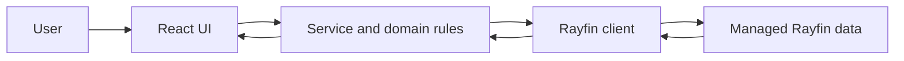

# How the application works

This is the least technical explanation of the Fabric Rayfin application. It describes the current implementation first; planned behaviour is labelled separately.

## What the application does

The application keeps project identity and project information in one place. **Project Register** creates and splits project references and shows their lineage. **Project Index** lets signed-in users find a project and work with its information and programme dates. **Programme Admin** maintains the shared definitions that make programme rows, summaries, dependencies and reporting mappings consistent across projects.

The wider specification includes Tenure and Board Report work. In the current UI, those areas are not complete: Tenure and Board Report are shown as disabled placeholders in the Project Index page.

## Project Register versus Project Index

- **Project Register** is restricted and handles project identity operations: create, planning splits, contract splits and history.
- **Project Index** is the broader workspace. It starts with a project list, opens a selected project by GUID, and currently includes Project Information, Reporting Programme and an implemented Target Programme/DDTC slice.
- **Programme Admin** is a separate global route, not a project tab. It is visible to users with the current admin role check.

## High-level user-to-data flow

A **service** is application code that performs an operation such as loading a project. A **domain rule** is code that checks or calculates business meaning independently of the screen.

This is a useful mental model, not a claim that every rule lives in exactly one layer. Some validation is in domain helpers, some orchestration is in services, and the UI controls what is editable.

## What the main technologies do

- **React** builds the screen from reusable components. A component is a function that returns the interface for one part of the page.
- **TypeScript** checks the shapes of values while the code is developed. For example, it can require a project summary to have a `projectGuid` and `projectName`.
- **Rayfin** supplies the application client, authentication integration and data API used by this app. A Rayfin **entity** is the typed representation of a data table/resource, such as `master_project_register`.
- **Vite** runs the local frontend development server and creates the browser build.

## Where project identity comes from

`master_project_register` is the source of project identity. Each project record has a stable `guid`; the app passes this value as `projectGuid` through Project Index routes and service calls. The active record is identified in current code by `effective_to` equal to `2099-12-31`. Historical records retain lineage fields such as `parent_guid` and `root_guid`.

This means a project name or display reference is not the safest identity to use for related data. Downstream Project Index records link to the active `project_guid`.

## Target Programme and Reporting Programme

The two programme views answer different questions:

- **Target Programme** describes the operational target dates for the centrally defined activities and milestones. The current code evaluates summaries and dependencies and displays stage workspaces.
- **Reporting Programme** holds reporting dates for lifecycle reporting rows. Current code maps reporting definitions to records and can patch reporting dates.

The `project_programme` entity can hold baseline, target and reporting date columns. Baseline dates are retained for downstream comparison but are not exposed as editable Project Index fields in the current UI. A reporting reference is read-only and connects a reporting date to the Target item used for comparison.

## Persisted versus derived programme values

Persisted values are records read from or written to Rayfin, such as a user-entered target date. Derived values are calculated from other values, such as summary start/end dates, dependency-driven dates, month/duration labels, and reporting references. Derived values should not be manually edited or treated as a second source of truth.

Current domain code validates dependency and summary graphs, prevents cycles, evaluates dependent dates and resolves explicit Reporting-to-Target mappings. Programme definitions and relationships are persisted centrally; project-specific dates are persisted against `project_guid`.

## What happens when a user opens a project

1. The user signs in through the configured Rayfin authentication provider.
2. The app opens `/project-index` by default, or `/project-index/:projectGuid` for a selected project.
3. `ProjectIndexPage` asks `projectIndexService` for the project list or workspace.
4. The service reads the project register, site register, project summary, team and programme records.
5. The page builds the tabs and renders editable or derived fields according to the loaded definitions and rules.
6. Historical projects can be opened, but current Target Programme write checks require an active project. The page also marks historical project information as not active/read-only where applicable.

## What happens when a user edits a field

A controlled input gets its displayed value from React state. When it changes, an event handler validates and updates the local working copy. The service then sends the permitted patch to Rayfin and the UI shows `Saving...`, `Saved` or `Save failed`.

Programme date changes use a keyed write queue so writes for the same project/programme record are ordered. The interface can update before the server response returns (an **optimistic update**); a failed save must be surfaced rather than silently treated as saved.

## Read next

- [Codebase tour](codebase-tour.md) for real file locations and change guidance
- [React and TypeScript for this project](../development/react-typescript-for-this-project.md)
- [Architecture overview](../architecture/architecture-overview.md)
- [Security overview](../security/security-overview.md)
