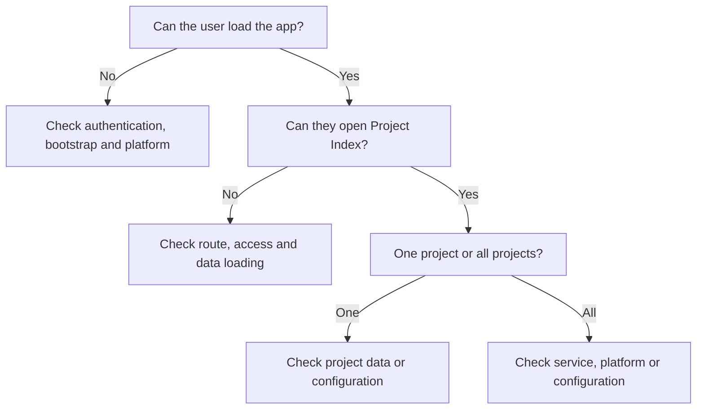

# Troubleshooting

This guide favours evidence collection over guesswork. Do not bypass access controls, edit production data directly, commit environment files, or redeploy blindly to see whether a problem disappears.

## Start with triage



## Before changing anything

Capture:

- the symptom and exact error text
- date, time and timezone
- route/page and environment
- whether one user or multiple users are affected
- whether one project or all projects are affected
- steps to reproduce
- expected versus actual behaviour
- the last known good behaviour or recent change, if known

## Information safe to collect

Where organisationally appropriate, collect a project reference or GUID, browser/version, route, redacted screenshot, exact user-visible error, reproduction steps and a commit/release identifier. Review screenshots, browser console output, network captures and logs before sharing: they may contain authentication/session values, cookies, project data or personal information.

Do not request or share passwords, access tokens, session tokens/cookies, secret-bearing environment files or unredacted sensitive logs.

## Symptom playbooks

### Application or sign-in does not load

- **Likely area:** bootstrap configuration, selected auth service, local Rayfin services, Fabric/Rayfin platform or browser session.
- **Safe checks:** identify whether the API URL is localhost or non-local; confirm the intended local environment is running; check the exact visible error; try a fresh browser session only if doing so is safe and does not discard useful evidence.
- **Evidence:** environment category (local/non-local), timestamp, route, browser, redacted error and whether other users are affected.
- **References:** [configuration reference](configuration-reference.md), `src/services/bootstrap.ts`, `src/services/MockAuthService.ts`, `src/services/RayfinAuthService.ts`.
- **Escalate when:** non-local configuration or platform authentication is implicated, multiple users are affected, or the error persists after safe configuration checks.

### Access card or route is unexpectedly unavailable

- **Likely area:** authentication state, `app_user_role` lookup, route guard or Programme Admin/Register access decision.
- **Safe checks:** confirm the user is signed in; identify whether the missing destination is Project Register or Admin; compare one user with another only through approved support processes; do not grant a role ad hoc.
- **Evidence:** user scope, route/card, timestamp and visible error/redirect. Do not collect tokens.
- **References:** `src/App.tsx`, `useProjectRegisterAccess.ts`, `useProgrammeAdminAccess.ts`, `projectRegisterAccess.ts`, `programmeAdminService.ts`, [security overview](../security/security-overview.md).
- **Escalate when:** role data or identity claims need changing, or the user can reach a route contrary to the approved access model.

### Project Index list fails to load

- **Likely area:** Rayfin API/data access, authentication session, Project Index query or environment configuration.
- **Safe checks:** reload once; determine whether the failure affects all projects or only a search/filter; capture the visible error and time; avoid repeated writes or deployment attempts.
- **Evidence:** route, search/history state, user/project scope, browser, exact error and release SHA.
- **References:** `src/pages/ProjectIndexPage.tsx`, `listProjectIndexProjects()` in `src/services/projectIndexService.ts`, [architecture overview](../architecture/architecture-overview.md).
- **Escalate when:** all users or all projects fail, or the error indicates platform/data policy failure.

### One project fails to open

- **Likely area:** project GUID/identity, missing related summary/programme records, historical state or project-specific data.
- **Safe checks:** record the project reference/GUID if appropriate; try another project without changing data; determine whether the project is historical; capture the exact error.
- **Evidence:** affected project scope, active/historical status, route, time, release and redacted error.
- **References:** `getProjectIndexWorkspace()` in `src/services/projectIndexService.ts`, `master_project_register`, [codebase tour](../getting-started/codebase-tour.md).
- **Escalate when:** only one record is affected and a data correction appears necessary. Do not edit the record directly.

### Save remains `Saving...` or shows `Save failed`

- **Likely area:** Rayfin write, validation, network/session, optimistic UI reconciliation or a concurrent write.
- **Safe checks:** wait for the displayed state; do not repeatedly click save; note the field, project and exact error; reload only after recording the unsaved value and only when safe.
- **Evidence:** field/area, project scope, `Saving...`/`Save failed` state, timestamp, exact error and whether another session may be editing the project.
- **References:** `ProjectIndexPage.tsx`, `projectIndexService.ts`, `programmeService.ts`, `targetProgrammeService.ts`, `keyedWriteQueue.ts`.
- **Escalate when:** the value is unclear, data may have diverged, or repeated controlled retries fail. Do not manually repair persisted rows.

### Reporting Programme date does not persist

- **Likely area:** date validation, canonical `project_programme` write, write queue or reporting mapping/reconciliation.
- **Safe checks:** confirm start/end ordering; identify whether the row is editable; record the displayed save state and error; reopen only after evidence is captured.
- **Evidence:** project GUID, definition/row label, date values (where safe), time, release and exact error.
- **References:** `handleReportingSave()` in `ProjectIndexPage.tsx`, `updateProjectProgrammeDates()` in `programmeService.ts`, [codebase tour](../getting-started/codebase-tour.md).
- **Escalate when:** the UI and persisted result disagree or the issue affects multiple rows/projects.

### Target Programme derived date looks wrong

- **Likely area:** programme definition, summary membership, dependency rule, reporting mapping or source dates.
- **Safe checks:** distinguish a manually entered source date from a derived summary/dependency/reference value; check whether the row is read-only; compare the relevant definition and relationship metadata through Programme Admin if authorised.
- **Evidence:** project/row, source and displayed dates, stage, mapping/dependency context and release.
- **References:** `src/domain/programmeRules.ts`, `src/domain/targetProgramme.ts`, `src/services/targetProgrammeService.ts`, Programme Admin, [architecture overview](../architecture/architecture-overview.md).
- **Escalate when:** configuration relationships appear invalid, cycles are suspected, or a data correction is proposed.

### Target stage is unexpectedly read-only or editable

- **Likely area:** Reporting Stage to Target Stage mapping, active/historical project state or stage definitions.
- **Safe checks:** record Reporting Stage and project active/historical state; compare the expected stage position (previous/current/future); do not bypass a read-only control.
- **Evidence:** project GUID, Reporting Stage, Target stage, displayed editability and time.
- **References:** `src/domain/targetProgrammeStages.ts`, `targetProgrammeService.ts`, [architecture overview](../architecture/architecture-overview.md).
- **Escalate when:** a historical project can be written, or current/future stage behaviour conflicts with the agreed specification.

### Programme Admin change behaves unexpectedly

- **Likely area:** admin role, validation rules, effective dates or relationship configuration.
- **Safe checks:** confirm the user has the effective `project_index_admin` role; capture the validation message; check whether the definition is active/retired and whether relationships reference it; do not delete or edit underlying rows directly.
- **Evidence:** Admin section, operation, exact validation/error, definition/mapping identifiers where safe, timestamp and release.
- **References:** `src/pages/AdminPage.tsx`, `src/services/programmeAdminService.ts`, `src/domain/programmeAdminRules.ts`, [configuration reference](configuration-reference.md).
- **Escalate when:** role provisioning, entity policy or structural data repair is required.

### Map fails while the rest of Project Index works

- **Likely area:** browser/network access to the hardcoded OpenStreetMap tile endpoint, tile response, map rendering or CSP.
- **Safe checks:** confirm other Project Index sections work; record whether the map alone is blank/erroring; review browser output only after redaction; do not alter network/security policy locally as a workaround.
- **Evidence:** route, browser, timestamp, redacted visible/browser error and whether other users/environments are affected.
- **References:** `ProjectIndexPage.tsx`, [architecture overview](../architecture/architecture-overview.md), [security overview](../security/security-overview.md).
- **Escalate when:** external service approval, CSP, outbound restrictions or provider behaviour needs a platform/organisational decision.

### Local development bootstrap or configuration fails

- **Likely area:** ignored local environment, Rayfin-generated environment, API URL branch or missing non-local variables.
- **Safe checks:** run the documented command from `Test_Fabric_App/`; confirm the intended local/non-local mode without printing values; check that generated files are not being staged; review the exact startup error.
- **Evidence:** command, environment category, timestamp, non-secret error and package/script version; never attach `.env.local` or `rayfin/.env*`.
- **References:** [configuration reference](configuration-reference.md), `package.json`, `src/services/bootstrap.ts`, `.gitignore`.
- **Escalate when:** Rayfin tooling or platform setup is failing beyond local configuration checks.

### Build or test fails

- **Likely area:** TypeScript/build configuration, lint rule, dependency install state or a changed test/domain rule.
- **Safe checks:** record the exact command and first meaningful error; confirm the commit and lockfile state; run the relevant focused test before broader commands; do not update dependencies as a diagnostic shortcut.
- **Evidence:** command, commit SHA, error text, affected file and environment category.
- **References:** `package.json`, `package-lock.json`, `src/__tests__/`, [deployment and release](deployment-and-release.md).
- **Escalate when:** the failure is unrelated to the change, requires dependency/schema modification, or cannot be reproduced from a clean checkout.

## Programme diagnostic mental model

Use the following distinctions before escalating:

- **Persisted input date problem:** the entered source value is rejected or is not written to canonical `project_programme`.
- **Programme definition/configuration problem:** row identity, stage, editability or derived flags are wrong; inspect Programme Admin metadata and validation rules.
- **Summary relationship problem:** a derived summary does not reflect its maintained child membership.
- **Dependency problem:** a Target date is controlled by a configured dependency or cycle/lag rule.
- **Reporting mapping problem:** a Reporting row references the wrong Target definition/field.
- **Optimistic UI/save reconciliation problem:** the screen updated locally but the write failed or a later reload disagrees.

## Error and monitoring limitation

The repository proves local UI error states and error handling, but does not establish central production monitoring, log aggregation, security event collection or operational alerting. Treat a lack of visible error as lack of evidence, not proof that the platform is healthy.

## Recovery boundaries

A support person can safely reload, reopen a project, reproduce the issue, capture evidence and compare an unaffected project/environment where appropriate. Controlled technical escalation is required for role repair, data correction, schema changes, Rayfin policy changes, redeployment, backup/restore or any action that could alter production data.

## Troubleshooting report template

```md
## Summary

## Environment

## Time observed (including timezone)

## User scope

## Project scope

## Route/page

## Steps to reproduce

## Expected

## Actual

## Exact error

## Screenshot/log attachment reviewed for secrets: yes/no

## Last known good behaviour

## Recent change/PR/release if known

## Additional notes
```

Do not add passwords, tokens, cookies, secret-bearing files or unredacted sensitive logs to this report.

For escalation responsibilities, see [support and escalation](support-and-escalation.md). For code locations, see the [codebase tour](../getting-started/codebase-tour.md).
